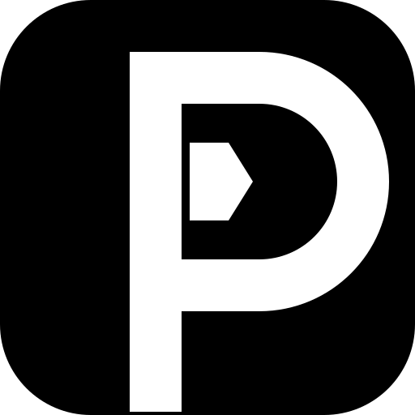

<div align="center">



# Pentabytes

### The AI Workspace for Builders

A premium, modular, enterprise-grade AI workspace built for developers, founders, creators, researchers, and teams.

Designed with a focus on performance, simplicity, scalability, and exceptional user experience.

---


</div>

---

# Overview

Pentabytes is a modern AI workspace engineered with a modular architecture and a premium user experience.

Instead of being another AI chat interface, Pentabytes is designed as an extensible workspace where developers, builders, researchers, and creators can interact with multiple AI providers through one clean interface.

The project emphasizes:

- Modular architecture
- Maintainable code
- High performance
- Accessibility
- Security
- Scalability
- Clean UI/UX

---

# Features

## Workspace

- Premium responsive interface
- Sidebar navigation
- Chat history
- Project management
- File management
- Settings panel
- Keyboard shortcuts
- Dark theme

---

## AI

- Multi-provider architecture
- OpenAI
- Anthropic Claude
- Google Gemini
- Groq
- Provider abstraction
- Streaming responses
- Future tool calling support
- Future vision support

---

## Developer Experience

- Vanilla JavaScript
- ES Modules
- Component architecture
- Modular CSS
- Local storage
- Easy maintenance
- Production-ready structure

---

# Folder Structure

```text
pentabytes/
│
├── assets/
│   ├── p-logo.svg
│   └── favicon.svg
│
├── css/
│   ├── core/
│   └── components/
│
├── js/
│   ├── core/
│   └── components/
│
├── index.html
└── README.md
```

---

# Architecture

```
User Interface
        │
        ▼
     UI Layer
        │
        ▼
   Application Core
        │
        ▼
 Conversation Engine
        │
        ▼
 Provider Adapter
        │
        ▼
 AI Providers
```

---

# Technology

- HTML5
- CSS3
- Vanilla JavaScript (ES Modules)

No frontend framework required.

---

# Design Philosophy

Pentabytes follows a minimalist engineering-first philosophy.

Principles include:

- Simplicity
- Speed
- Readability
- Scalability
- Accessibility
- Consistency

The interface is intentionally restrained, prioritizing clarity over visual excess.

---

# Performance Goals

- Fast initial load
- Minimal dependencies
- Responsive interactions
- Clean rendering
- Modular architecture
- Low memory usage

---

# Accessibility

Pentabytes is designed with accessibility in mind.

- Semantic HTML
- Keyboard navigation
- ARIA support
- Screen reader compatibility
- Focus management
- Responsive layouts

---

# Roadmap

### V2

- Premium Workspace
- Modular Architecture
- Responsive UI
- Chat History
- Multiple AI Providers

### V3

- Voice Conversations
- Vision Support
- File Analysis
- Image Generation
- Prompt Library

### V4

- Teams
- Shared Workspaces
- Collaboration
- Plugins
- Extensions

### Future

- Local Models
- AI Agents
- Automation
- Enterprise Deployment

---

# Getting Started

Clone the repository

```bash
git clone https://github.com/your-username/pentabytes.git
```

Open the project

```bash
cd pentabytes
```

Serve locally

```bash
python -m http.server
```

or use any local development server.

---

# Contributing

Contributions are welcome.

Please open an issue before submitting major changes.

---

# License

This project is licensed under the MIT License.

---

<div align="center">

Built with passion by the Pentabytes team.

**Building the future of AI workspaces.**

</div>
